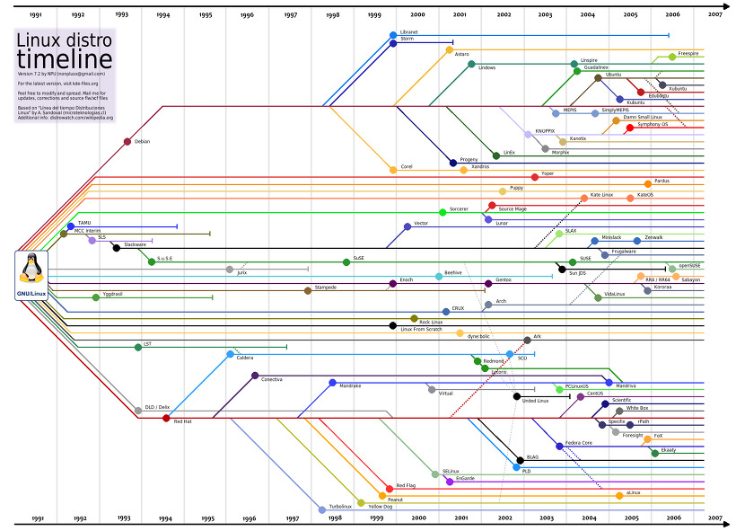

# 리눅스란?
#

## 1. 리눅스란?
> ##### 하드웨어와 소프트웨어
> 
> - 하드웨어 : 컴퓨터나 컴퓨터에 붙어있는 주변 장치들 (모니터, 키보드, 마우스, 하드디스크 등등)
> - 소프트웨어 : 컴퓨터 프로그램

> ##### 운영체제(OS)
>
> - 컴퓨터(하드웨어)와 사용자간의 인터페이스로서 동작하는 시스템 소프트웨어의 일종
> - 사용자가 컴퓨터를 편리하고 효과적으로 사용할 수 있도록 환경을 제공하는 프로그램의 모임
> - 컴퓨터의 자원(메모리, CPU)을 효율적으로 관리
> - 윈도우, 맥OS, Linux, 안드로이드, iOS 등등

> ##### 리눅스란?
> 
> - 오픈소스 기반의 운영체제의 일종으로 컴퓨터 사용자와 컴퓨터 하드웨어 간의 인터페이스로서 동작하는 시스템 소프트웨어
> - 다른 응용프로그램이 유용한 작업을 할 수 있도록 환경을 제공
> - 리눅스로 운영하는 서버에는 최고권한자(ROOT 사용자)가 있고, 이 루트 사용자는 서버에 대한 모든 권한을 가진다.
##

## 2. 리눅스의 개요
> ##### 리눅스의 역사
>
> 1969년 MIT, AT&T 벨 연구소의 켄 톰슨(Ken Thompson), 초기 형태의 UNIX 개발
> 핀란드 헬싱키 대학의 리누스 토발즈(Linus Torvalds)가 Minix의 커널소스를 고쳐 GNU 시스템에 적합한 커널을 개발함.

> ##### 리눅스와 타 OS들의 차이점
>
> Windows, Mac, 안드로이드, iOS 등은 일반 사용자들을 대상으로 만든 운영체제로 조작이 쉬운 반면
> Linux의 경우 서버를 운영하기에 좋은 운영체제로 개발자들을 대상으로 만들어져서 사용하기 위해서는 전문적인 지식을 필요로 함.
> ex) 요리로 비교할 경우
>     Windows, Mac = 밀키트 / Linux = 원 재료

> ##### 리눅스의 장점
> - 오픈소스라서 무료 사용이 가능
> - 다중 사용자와 다중 작업이 가능

> ##### 리눅스의 구조
> 하드웨어(HW), 커널(Kernel) 쉘(shell), 응용 프로그램으로 구성 
>
> - 하드웨어(HW) : 컴퓨터의 전자.기계장치의 몸체 자체
> - 커널(Kernel) : 하드웨어와 소프트웨어의 연결 다리
> - 쉘(shell) : 커널과 사용자를 연결해주는 인터페이스, 검은 배경에 흰색 글씨로 이루어진 창
> - 응용 프로그램 : 리눅스 내부의 응용프로그램

> ##### 리눅스 주요 디렉토리
> ###### / (최상위 디렉토리)
>   - 리눅스 상에 존재하는 모든 파일과 디렉토리의 시작
>   - 최상위에 위치하는 디렉토리
>    
> ###### /boot
>   - 부팅 과정에서 필요한 정보 파일들의 경로
>   - boot partition 설정시에는 1GB이상 용량을 설정
>
> ###### /bin (binary)
>   - /user/bin
>   - *.exe (실행파일)
>   - 기본적인 명령어 실행파일들의 경로
>
> ###### /sbin (system binary)
>   - *.exe (실행파일)
>   - 시스템운영, 관리에 필요한 명령어 경로
>   - 관리자용 명령어
>
> ###### /root
>   - 관리자(root)의 home directory
>     - home directory : 계정에 대한 정보를 저장하고 있는 디렉토리
>
> ###### /home
>   - 일반 사용자들의 home directory가 저장되는 경로
>     - 윈도우는 관리자, 사용자가 같은 곳에 위치
>     - 리눅스는 관리자, 사용자가 서로 다른 곳에 위치
>
> ###### /dev (device)
>   - 각종 장치파일들이 저장되는 경로
>     - 리눅스 시스템은 장치로서 인식하는 것이 아니라 장치파일로 인식
>
> ###### /etc
>   - 서버 설정에 필요한 모든 정보파일들의 경로 (시스템 관련)
>
> ###### /usr
>   - 리눅스 응용프로그램 기본 설치 경로
>     - 윈도우의 프로그램 파일 폴더 유사
>   - 대용량 데이터 보관 용도로도 사용
>
> ###### /var
>   - 로그(log) 파일들의 경로
##

## 3. 리눅스의 종류
> - 리눅스는 UNIX를 바탕으로 개발되었기 때문에 스렉웨어 계열, 데비안 계열, 레드햇 계열 등등 수많은 리눅스가 존재한다.
>   ex) Fedora, OpenSUSE, Ubuntu, centOS, Pocky Linux..
>
>  
##
