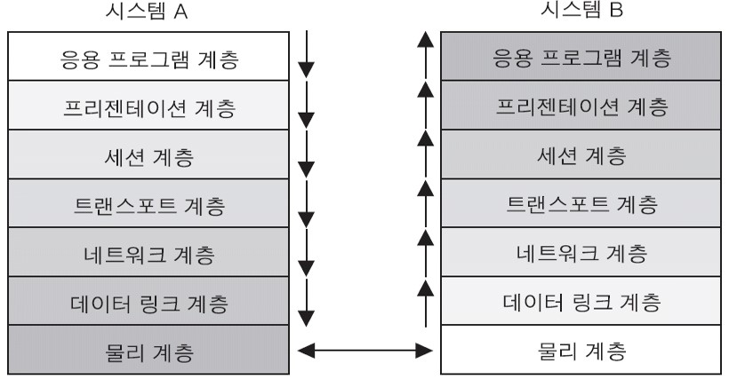

# 네트워크2
#

## # OSI 7 계층

> #### OSI 7 Layer 모델과 TCP/IP 모델
> 1) OSI 7 Layer 모델
> - 국제 표준화 기구(ISO)가 1984년에 발표한 OSI 7 Layer는 통신이 일어나는 과정을 7단계로 구분해서 한눈에 들어올 수 있도록 보여준다.
> - 컴퓨터 통신 구조의 모델과 앞으로 개발될  프로토콜의 표준적인 뼈대를 제공하기 위해서 개발된 참조 모델
>
> 2) TCP/IP 모델
> - 미국에서 개발한 인터넷의 기본 통신 프로토콜, DOD Model(미국방성 모델)을 기반으로 개발    
>   - TCP : 연결지향형 프로토콜, 세션의 연결과 종료, 흐름제어, 패킷의 분할 및 재조립
>   - IP : 비 연결지향형 프로토콜, 데이터 전송
>
> \* OSI 7 Layer는 장비 개발자들이 어떻게 표준을 잡을지 결정할 때 사용하고, TCP/IP 는 실질적으로 사용되는 프로토콜이다.
##

> #### # OSI 7 Layer 모델
> - 데이터의 흐름이 한 눈에 보인다.
> - Trouble shooting이 쉽다.
> - 네트워크를 공부하는 사람들이 네트워크 동작과정을 쉽게 습득할 수 있다.
> - 계층을 7 단계로 구분하고 각 층별로 표준화를 했기 때문에 여러 회사 장비를 사용해도 네트워크가 이상 없이 돌아간다.

> #### # 1계층 : Physical Layer (물리 계층)
> - 네트워크 통신을 위한 물리적인 표준 정의
> - 두 컴퓨터간에 전기적, 기계적, 절차적인 연결을 정의하는 계층
>   (케이블 종류, 데이터 송수신 속도, 신호의 전기 전압 등)
> - 장비
>   - 리피터, 허브

> #### # 2계층 : Data link Layer (데이터 링크 계층)
> - 데이터 링크 계층은 물리적 계층을 통한 데이터 전송에 신뢰성을 제공
> - 직접 연결되어 있지 않는 네트워크에 대해서는 상위 계층에서 오류 제어 담당
> - 이더넷, 토큰링,시리얼라인 연결 등 다양
> - 기능
>   - 물리적  주소(MAC)지정
>   - 네트워크 토폴로지
>   - 오류 통지
>   - 프레임의  순차적 전송
>   - 흐름 제어
> - 목적
>   - 로컬 네트워크에서 프레임을 안전하게 전송
> - 장비
>   - Switch, Bridge 

> #### # 3계층 : Network Layer (네트워크 계층)
> - Logical address (IP, IPX)를 담당하고 packet(패킷)의 이동 경로를 결정
> - 경로선택, 라우팅, 논리적인 주소를 정의하는 계층
> - 라우팅 프로토콜을 이용해서 best path(최적 경로) 선택
> - 장비
>   - Router

> #### # 4계층 : Transport Layer (전송 계층)
> - 정보를 분할하고, 상대편에 도달하기 전에 다시 합치는 과정을 담당
> (Segment : Layer 4의 data 단위)
> - 송수신 간에 에러제어(error control)와 흐름제어(flow control) 담당
> - Layer4 프로토콜 : TCP, UDP
>   - TCP : 신뢰성, 연결지향성
>   - UDP : 비 신뢰성, 비연결지향성

> #### # 5계층 : Session Layer (세션 계층)
> - 네트워크 상에서 통신을 할 경우 양쪽 호스트 간에 최초 연결
> - 통신 중 연결이 끊어지지 않도록 유지 시켜주는 역할
> - 통신중인 두 호스트들 간의 세션 open/close 및 관리 기능 담당
   
> #### # 6계층 : Presentation Layer (표현 계층)
> - 전송하는 데이터의 Format 결정
> - 다양한 데이터 Format을 일관되게 상호 변환
> - 압축기능 및 암호화, 복호화 기능 수행
> - ASCII, EBCDIC, GIF, JPEG, AVI, MPEG 등

> #### # 7계층 : Application Layer (응용계층)
> - 사용자 인터페이스의 역할을 담당하는 계층
> - 사용자들이 이용하는 네트워크 응용 프로그램 
> (ex. 인터넷 익스플로러)
> - 사용자와 가장 가까운 프로토콜 정의 
>   - HTTP(80), FTP(20, 21), Telnet(23), SMTP(25), DNS(53), TFTP(69) 등
##

> #### # OSI 7 계층 흐름도
> 

