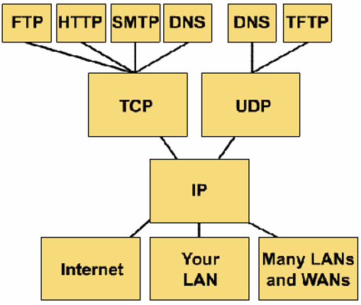

# 네트워크2
#

## # TCP/IP 4 계층

> - OSI 7 계층을 실질적으로 사용하는 표준으로 크게 4개로 나눈 계층
> - 응용계층 (Application layer)
>   - 효율성 고려 ( 응용계층 + 표현계층 + 세션계층)
> - 전송계층 (transport layer)
>   - 신뢰도, 흐름제어 에러제어를 위한 재전송 책임
>   - TCP는 연결형 서비스를 제공 (논리적 연결)
> - 인터넷계층(internet layer)
>   - IP(internet protocol)라고 함
>   - 경로설정, 패킷 스위칭(네트워크계층)
> - 네트워크 접속계층 (network access layer)
>   - Data link layer + physical layer
##

    
    

        
-----> 응용 계층

        
-----> 전송 계층

        
-----> 인터넷 계층

        
-----> 네트워크  접속 계층

    

##

> #### # OSI 7 Layer와 TCP/IP 비교
> 1. 유사점
> - 둘 다 계층형
> 2. 차이점
> - TCP/IP는 표현 계층과 세션 계층을 응용계층에서 처리
> - TCP/IP는 OSI 데이터링크 계층과 물리 계층이 하나로 표현
> - TCP/IP는 인터넷 개발 이후 계속 표준.
> (수십년간 운용 경험에 의해 신뢰도가 높다)
> - OSI는 가이드 역할로 충실하지만 실제 구현의 예가 거의 없어 신뢰도가 약하다.
##

## # 계층 별 사용 장비

> - Physical Layer (물리계층)
>   - Repeater(리피터), Hub
> - Date link Layer (데이터 링크 계층)
>   - Switch, Bridge
> - Network Layer (네트워크 계층)
>   - Router(라우터), L3 Switch

> #### # Physical Layer (물리계층)
> - 인접장비간 적용되는 물리적 protocol (신호 변환 방식, 속도, LAN에 사용되는 connector 및 cable 종류 등)를 정의
>
> 1) 리피터 : 증폭
>    - cable 전송으로 약화된 신호를 초기화, 증폭, 재전송의 기능을 수행
>    - 리피터와 허브는 상위 계층에서 사용하는 MAC 주소나 IP주소를 이해하지 못하고 단지 전기 신호만을 증폭시키는 역할
>    - 이제 리피터 대신 허브를 사용
>
> 2) 허브 : 증폭 + 여러대의 장비를 LAN에 다중접속
>    - 리피터와 마찬가지로 전기적 신호를 증폭 
>    - LAN 전송거리를 연장시키고 여러 대의 장비를 LAN에 접속 가능하게 해줌 (멀티 포트 리피터)
>    - 한개의 Collision domain (일차선)
>    - 많이 연결될수록 전송속도 느려짐
>    - 허브에 연결된 모든장비에 전송 == (flooding)
>
> 인텔리젠트 허브 | 더미 허브
> :---: | :---: 
> 대형 네트워크 사용시 | 소형 네트워크 사용시
> ` * 나누는기준 : 네트워크가 문제 없이 작동하고 있는지 검사 시스템의 유무`

> #### # Date link Layer (데이터 링크 계층)
> - MAC address를 사용하는 계층
>
> - LLC (Logical Link Control)
>    - Data link의 부 계층 중 하나로  물리적 매체 상에서 흐름제어와 에러제어 등의 트래픽 관리에 관여
>    - 두 장비간에 link를 설정하고 Frame을 송수신하는 방식과 상위 레이어 protocol의 종류를 알리는 역할  
> - MAC (Media Access Control)
>    - Frame의 포맷, Ethernet 동작 방식, 충돌감지 및 재전송 방식 등을 정의
>
> 1) 브릿지
>    - Ethernet 장비를 물리적으로 연결
>    - 프래임을 다시 만들어서 전송
>    - MAC 주소를 보고 전송 포트를 결정
>    - 현재는 브릿지보다 스위치를 사용
> 
> 2) 스위치
>    -  각각의 포트가 하나의 Collision domain에 있다
>    -  MAC 주소를 보고 전송 포트를 결정               
>       => 다 차선 도로 Collision domain을 나누는 기준 = 포트 번호
 
> #### # Network Layer (네트워크 계층)
> - IP 주소(논리적인 주소)를 사용하는 계층
>
> 1) 라우터
>    - IP주소를 보고 목적지와 연결되는 포트로 패킷 전송
>      == (라우팅 : 목적지를 찾는것)
>    - 네트워크보안, Qos 기능
>    - Qos : 프로토콜, 주소 및 포트 번호를 기준으로 트래픽 간의 우선 순위를 정함
>      수신 또는 송신 시 트래픽을 필터링
>      (네트워크 장치에서 일정 시간 내에 흐르는 데이터의 양)
##

> #### # 전송단위 
> - 물리계층 : (0, 1로 이루어진 전기적신호 - 128 바이트) -> 패킷
> - 데이터링크계층 : 비트를 바이트로 변환 바이트 뭉친 단위 -> 프레임

