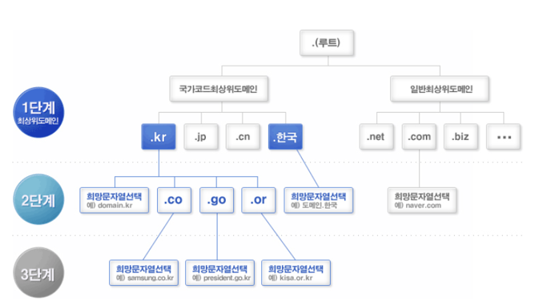

# 네트워크3
#


## # Host (호스트)

> - Host는 Guest를 맞이하는 주인을 의미
> - 이 의미가 그대로 적용되어 IT에서의 호스트는 무언가를 받아주는 객체
> ```
>    ex) 예를들어 태블릿pc로 검색엔진에 ‘naver'를 검색한다면,
>        검색을 요청하는 내 테블릿pc가 클라이언트, 
>        검색 결과를 보여주는 검색 엔진이 호스트.
> ```
> - 호스트는 네트워크에 연결되어 있고 IP를 가지고 있는 시스템을 의미
##


## # Domain (도메인)
> #### # 도메인이란?
> - 컴퓨터가 처리할 수 있는 숫자로 된 인터넷 주소가 IP주소
> - IP주소를 사람이 기억하기 쉽게 문자로 바꾼 인터넷 주소가 도메인

> #### # 호스팅이란?
> - 서버를 만든 후 네트워크에 띄워서 서비스하는 일련의 과정
> - IP와 서버를 연결하는 작업
> ```
>    - 요즘엔 호스팅 업체가 많고 다양 함.
>    - 서비스를 하려면 서버가 24시간 돌아야 하고, 
>      로컬에서 하기엔 금액이나 물리적으로 한계가 있기 때문에
>      호스팅 업체가 이를 대신 해 줌 (대표적으로 카페24)

> #### # 도메인 체계
> 
> `표시 순서 : 마지막(.com) -> 첫번째(www) =
>  자식 -> 부모 관계 = 역트리 구조`
>
> ##### # 1단계 도메인(Top Level Domain, TLD) = 최상위 도메인
> - 마지막에 쓰이는 도메인으로 www.google.com의 .com 쪽
> - 최상위 도메인은 인터넷에서 도메인명의 가장 마지막 부분
> - 종류는 크게 3가지
>
> 1) 국가코드 최상위 도메인
>     - 국가/지역을 나타내는 도메인
>     - 해당 국가지역에 거주하는 단체 및 개인만이 취득 가능
>     - 현재 250여개의 도메인이 존재
> 2) 일반 최상위 도메인 (Generic Top Level Domain, gTLD)
>     - 인터넷 초창기부터 사용된 도메인
>     - .com은 거의 포화상태일 정도로 많은 곳에서 사용 중
>     - edu - 미국 교육기관 / gov - 미국 정부기관
>     - mil - 미국 국방기관 / biz - 비즈니스
>     - com - 영리기관 / org - 비영리 공공기관
>     - int - 국제기구 / net - 네트워크 관련기관
> 3) 신규 일반 최상위 도메인 (New Generic Top Level Domain, New gTLD)
>     - 일반 최상위 도메인의 수량적 한계로 만들어짐
>     - 현재 가장 활발하게 늘어나고 있다. 
>     - 특징은 일반 최상위 도메인과 동일
>
> ##### # 2단계 도메인(Second Level Domain, SLD) = 차상위 도메인
> - 1단계 도메인에서 분류값이 필요할 때 사용
> ```
>     ex) 정부 사이트 접속시, 1단계 도메인은 국가/지역을 구분하는 .kr
>         2단계 도메인은 kr의 국가 내에서 존재하는 정부의 도메인 .go
> ```
>
> ##### # 3단계 도메인 (Domain Name, 도메인명)
> - 도메인 가운데에 표시되는 이름
> - 해당 단계는 자율적으로 지정 가능
##


## # DNS (Domain Name Service)
> (도메인)네임서버라고도 불리며, 인터넷망 통신규약인 TCP/IP 네트워크 상에서 도메인을 IP로 바꿔주는 시스템 혹은 이런 역할을 하는 서버 컴퓨터를 의미
> - 도메인과 IP 주소를 저장해 놓은 시스템
> - 전 세계의 IP 주소에 대응하는 도메인을 효율적으로 관리하기 위해 개발된 시스템
> - DNS 서버 : IP 주소와 도메인을 저장하고 관리하는 컴퓨터나 애플리케이션
> (IP 주소와 도메인을 저장하고 맵핑(mapping)하는 일종의 데이터베이스)

> #### # 도메인의 가치
> - 인터넷에서 동일한 도메인은 존재할 수 없기 때문에 누군가 이미 등록한 도메인은 사용할 수 없음 
> - 브랜드 명이나 회사 명의 도메인을 다른 누군가가 등록해서 사용하고 있다면 그 도메인을 구매하는 등의 방법으로 도메인을 가져와야 사용 가능
> ```
> 대표적으로 페이스북은 2010년 fb.com 도메인을 850만 달러(약 90억)를 주고 구매, 
> 샤오미는 2014년 Mi.com이라는 도메인을 360만 달러(약 40억)에 구매 함
> ```
##
